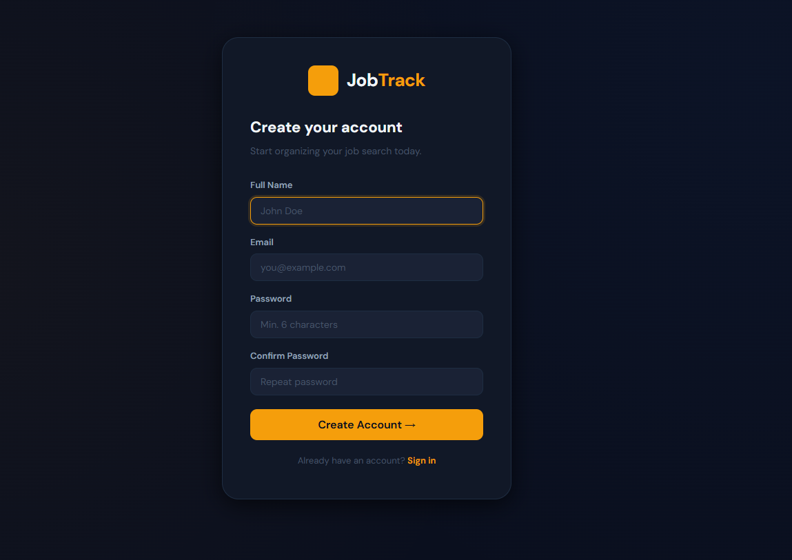
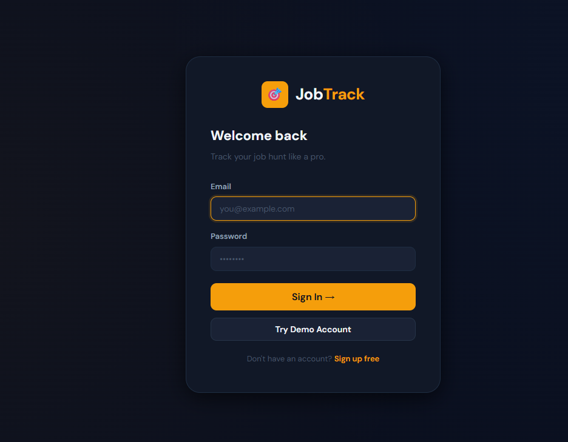
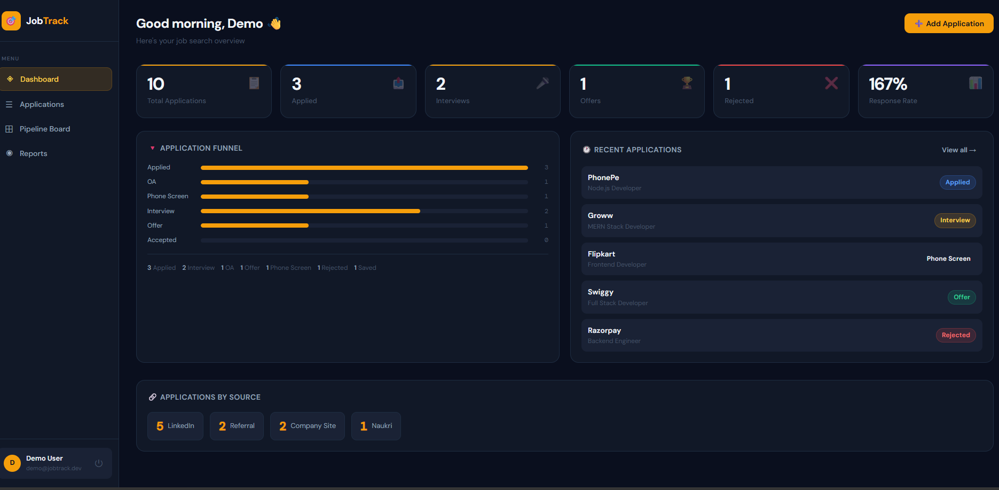
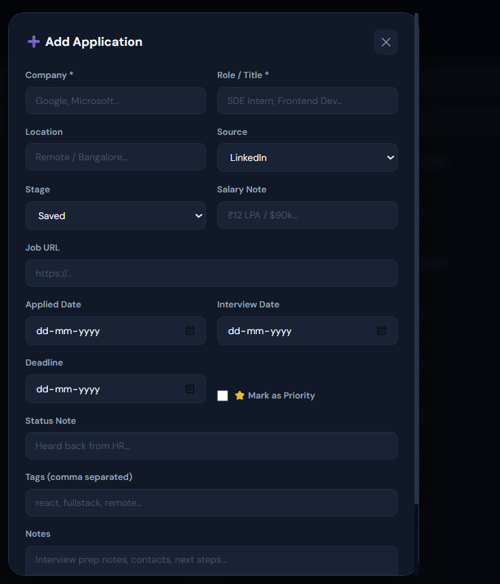

# JobTrack — Job Application Tracker Portal

> A full-stack MERN application to track job applications, interview stages, and get analytics on your job hunt.


---

## Problem Statement

Students and professionals apply to dozens of jobs across LinkedIn, Indeed, Naukri, and company portals. Without a central tracker:

- Applications get forgotten
- Interview dates are missed
- Offer deadlines pass unnoticed
- There's no way to measure what's working

**JobTrack** solves this with a structured, beautiful, and data-driven portal.

---

## Features

| Feature          | Description                                         |
| ---------------- | --------------------------------------------------- |
| Auth             | JWT-based register/login with bcrypt                |
| Add Applications | Company, role, location, salary, source, URL        |
| Stage Tracking   | Saved → Applied → OA → Interview → Offer → Accepted |
| Priority Flag    | Mark important applications                         |
| Search & Filter  | Filter by stage, source; search by company/role     |
| Dashboard        | Stats cards, recent applications, source breakdown  |
| Kanban Board     | Visual pipeline with one-click stage moves          |
| Reports          | Bar charts, pie charts, weekly trends (recharts)    |
| Responsive       | Works on mobile and desktop                         |

---

## Tech Stack

**Frontend**

- React.js 18 (CRA)
- React Router v6
- Axios (API calls with JWT interceptors)
- Recharts (analytics charts)
- React Hot Toast (notifications)
- Custom CSS (dark editorial theme, no framework dependency)

**Backend**

- Node.js + Express.js
- Mongoose (MongoDB ODM)
- bcryptjs (password hashing)
- jsonwebtoken (JWT auth)
- Morgan (request logging)

**Database**

- MongoDB (local or Atlas)

---

## Folder Structure

```
Job-Application-Tracker-Portal/
│
├── client/                      # React frontend
│   ├── public/
│   │   └── index.html
│   ├── src/
│   │   ├── components/          # Reusable components
│   │   │   ├── Layout.js        # App shell + sidebar
│   │   │   └── ApplicationModal.js # Add/Edit modal
│   │   ├── context/
│   │   │   └── AuthContext.js   # Global auth state
│   │   ├── pages/
│   │   │   ├── LoginPage.js
│   │   │   ├── RegisterPage.js
│   │   │   ├── DashboardPage.js
│   │   │   ├── ApplicationsPage.js
│   │   │   ├── KanbanPage.js
│   │   │   └── ReportsPage.js
│   │   ├── utils/
│   │   │   └── api.js           # Axios instance
│   │   ├── App.js               # Root + routes
│   │   └── index.css            # Global styles
│   └── package.json
│
├── server/                      # Express backend
│   ├── config/
│   │   └── db.js                # MongoDB connection
│   ├── controllers/
│   │   ├── authController.js    # Register, login, getMe
│   │   ├── applicationController.js  # Full CRUD
│   │   └── dashboardController.js    # Analytics
│   ├── middleware/
│   │   └── authMiddleware.js    # JWT protect middleware
│   ├── models/
│   │   ├── User.js              # User schema
│   │   └── JobApplication.js   # Application schema
│   ├── routes/
│   │   ├── authRoutes.js
│   │   ├── applicationRoutes.js
│   │   └── dashboardRoutes.js
│   ├── .env.example
│   ├── index.js                 # Server entry point
│   └── package.json
│
├── docs/                        # Screenshots, diagrams
├── .gitignore
└── README.md
```

---

## API Endpoints

### Auth

| Method | Endpoint             | Description                  |
| ------ | -------------------- | ---------------------------- |
| POST   | `/api/auth/register` | Create new user              |
| POST   | `/api/auth/login`    | Login + get JWT              |
| GET    | `/api/auth/me`       | Get current user (protected) |

### Applications (all protected)

| Method | Endpoint                      | Description             |
| ------ | ----------------------------- | ----------------------- |
| GET    | `/api/applications`           | List all (with filters) |
| POST   | `/api/applications`           | Create new application  |
| GET    | `/api/applications/:id`       | Get single application  |
| PUT    | `/api/applications/:id`       | Full update             |
| DELETE | `/api/applications/:id`       | Delete                  |
| PATCH  | `/api/applications/:id/stage` | Update stage only       |

### Dashboard

| Method | Endpoint                 | Description    |
| ------ | ------------------------ | -------------- |
| GET    | `/api/dashboard/summary` | Analytics data |

---

## Installation & Setup

### Prerequisites

- Node.js 18+
- MongoDB (local) or MongoDB Atlas account

### 1. Clone the repository

```bash
git clone https://github.com/YOUR_USERNAME/Job-Application-Tracker-Portal.git
cd Job-Application-Tracker-Portal
```

### 2. Backend setup

```bash
cd server
npm install
cp .env.example .env
# Edit .env with your MongoDB URI and a secret JWT key
npm run dev
```

### 3. Frontend setup

```bash
cd client
npm install
npm start
```

### 4. Environment variables (`server/.env`)

```
PORT=5000
MONGO_URI=mongodb://localhost:27017/job_tracker
JWT_SECRET=your_super_secret_key_here
JWT_EXPIRES_IN=7d
NODE_ENV=development
```

### 5. Access the app

- Frontend: http://localhost:3000
- Backend API: http://localhost:5000

---

## 📸 Screenshots to Capture

## Screenshots

### Register Page



### Login Page



### Dashboard



### Kanban dashboard


### Add Application



### Application

![application]docs/screenshots/Application.png

### Reports and Analytics


### MongoDB Collections


## 🎬 Demo Video

[](https://youtu.be/WdKlcD4WcEc)

Click the image above to watch the full demo.

## Learning Outcomes

After building this project you will understand:

- Full-stack MERN architecture and separation of concerns
- JWT authentication flow (register → token → protected routes)
- RESTful API design with Express.js
- Mongoose schema design with relationships
- React Context API for global state
- Axios interceptors for automatic token attachment
- React Router v6 with protected/public routes
- Building reusable components (modals, layouts)
- Data visualization with Recharts
- MongoDB aggregation pipelines for analytics

---

## Author

Sonia Thakur

GitHub:
https://github.com/Sonia068

LinkedIn:
https://www.linkedin.com/in/sonia-thakur-6ab93b349/

---

⭐ If you found this project useful, please give it a star on GitHub.
