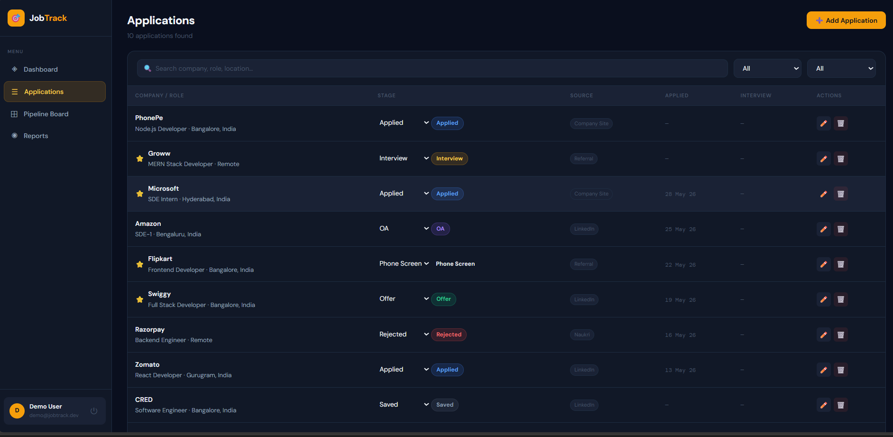
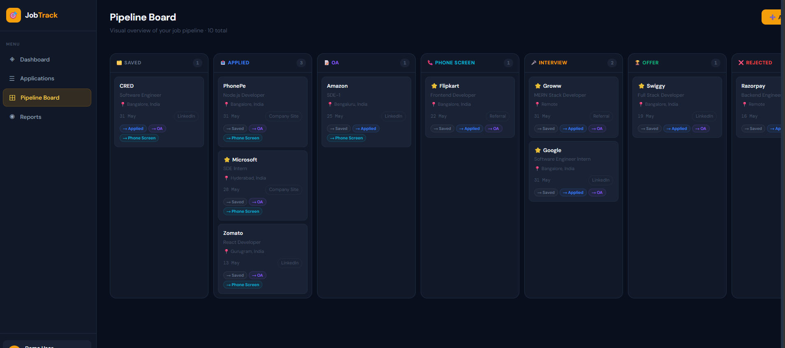
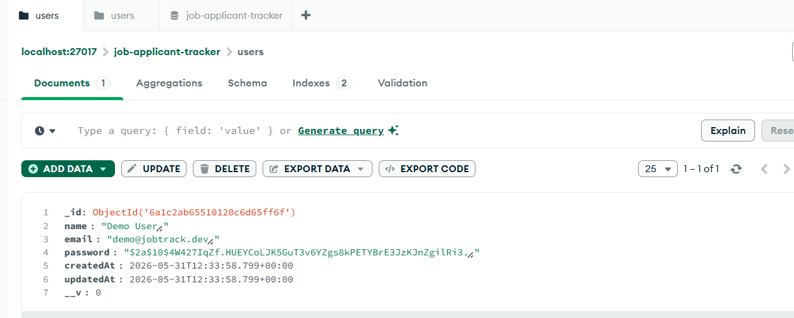
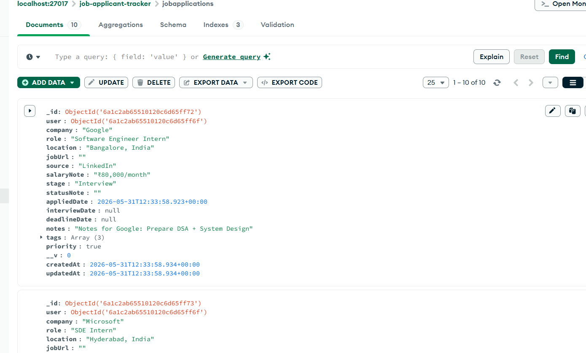

# AppliJobTrack

### Full-Stack Job Application Tracking Platform

A production-deployed MERN application for managing job applications, tracking recruitment stages, monitoring interviews and offers, and visualizing job-search activity through an analytics dashboard.

<p align="center">

<a href="https://applijobtrack.onrender.com">
  
</a>

<a href="https://applijobtrack-api.onrender.com">
  
</a>

<a href="https://github.com/vishuu-patil-001/AppliJobTrack">
  
</a>

</p>

<p align="center">


</p>

---

## Overview

Job searching often involves managing applications across multiple companies, job boards, referrals, and career portals.

Without a centralized system, it becomes difficult to keep track of:

- submitted applications
- application stages
- interview schedules
- application deadlines
- offers
- priorities
- job sources
- overall application progress

**AppliJobTrack** solves this problem by providing a centralized application-management platform with authentication, CRUD operations, pipeline tracking, search and filtering, dashboard analytics, and a Kanban-style workflow.

The application is fully deployed with a React frontend, Node.js/Express API, and MongoDB database.

---

## Live Application

### Frontend

**https://applijobtrack.onrender.com**

### Backend API

**https://applijobtrack-api.onrender.com**

### API Health Check

**https://applijobtrack-api.onrender.com/**

Expected response:

```json
{
  "success": true,
  "message": "AppliJobTrack API is running"
}
```

---

# Screenshots

> The following screenshots demonstrate the main application workflow and database structure.

### 1. User Login


### 2. User Registration


### 3. Dashboard


### 4. Applications



### 5. Add Application


### 6. Kanban Pipeline



### 7. Reports & Analytics


### 8. MongoDB Users Collection



### 9. MongoDB Job Applications Collection



### 10. MongoDB Application Document


---


# Core Features

| Area | Capabilities |
|---|---|
| Authentication | User registration, login, JWT authentication and protected API routes |
| Application Management | Create, view, update and delete job applications |
| Pipeline Tracking | Saved, Applied, OA, Interview, Offer and Accepted stages |
| Kanban Workflow | Move applications between recruitment stages |
| Search | Search applications by company, role and location |
| Filtering | Filter by stage, source and priority |
| Priority Management | Mark important applications for quick identification |
| Dashboard | Application statistics, recent applications and source breakdown |
| Analytics | Application trends and recruitment activity visualization |
| Multi-User Support | Each authenticated user accesses only their own applications |
| Responsive UI | Designed for desktop and mobile layouts |
| Production Deployment | React frontend and Express backend deployed independently |

---

# Application Workflow

```text
                    ┌──────────────┐
                    │   Register   │
                    └──────┬───────┘
                           │
                           ▼
                    ┌──────────────┐
                    │     Login    │
                    └──────┬───────┘
                           │
                           ▼
                 ┌────────────────────┐
                 │ JWT Authentication │
                 └─────────┬──────────┘
                           │
                           ▼
                    ┌──────────────┐
                    │   Dashboard  │
                    └──────┬───────┘
                           │
                           ▼
              ┌─────────────────────────┐
              │ Create Job Application  │
              └────────────┬────────────┘
                           │
                           ▼
                 ┌────────────────────┐
                 │ Application Board  │
                 └─────────┬──────────┘
                           │
          ┌────────────────┼────────────────┐
          ▼                ▼                ▼
       Search           Filter          Priority
          │                │                │
          └────────────────┼────────────────┘
                           ▼
                 ┌────────────────────┐
                 │ Track Application  │
                 └─────────┬──────────┘
                           │
                           ▼
                Interview / Offer
                           │
                           ▼
                       Accepted
                           │
                           ▼
                 Reports & Analytics
```

---

# Application Pipeline

Applications can move through the following recruitment stages:

```text
Saved
  │
  ▼
Applied
  │
  ▼
OA
  │
  ▼
Interview
  │
  ▼
Offer
  │
  ▼
Accepted
```

The Kanban interface provides a visual representation of this workflow and allows application stages to be updated efficiently.

---

# Technical Architecture

```text
┌──────────────────────────────────────────────┐
│                  User Browser                │
│                                              │
│              React Application               │
│          React Router + Context API           │
└──────────────────────┬───────────────────────┘
                       │
                       │ HTTP / JSON
                       │ Axios
                       ▼
┌──────────────────────────────────────────────┐
│              Express.js REST API             │
│                                              │
│  ┌────────────┐   ┌──────────────────────┐   │
│  │ Auth Routes│   │ Application Routes   │   │
│  └────────────┘   └──────────────────────┘   │
│                                              │
│  ┌────────────────┐  ┌───────────────────┐   │
│  │ Dashboard API  │  │ JWT Middleware    │   │
│  └────────────────┘  └───────────────────┘   │
└──────────────────────┬───────────────────────┘
                       │
                       │ Mongoose
                       ▼
┌──────────────────────────────────────────────┐
│                MongoDB Atlas                 │
│                                              │
│       Users + Job Applications               │
└──────────────────────────────────────────────┘
```

---

# Technology Stack

## Frontend

- React 18
- React Router v6
- Axios
- Recharts
- React Hot Toast
- Custom CSS

## Backend

- Node.js
- Express.js
- Mongoose
- bcryptjs
- JSON Web Token
- Express Validator
- Morgan
- CORS
- dotenv

## Database

- MongoDB
- MongoDB Atlas

## Deployment

- Render
- GitHub
- Separate frontend and backend services

---

# Project Structure

```text
AppliJobTrack/
│
├── client/
│   ├── public/
│   │   └── index.html
│   │
│   ├── src/
│   │   ├── components/
│   │   ├── context/
│   │   ├── pages/
│   │   ├── services/
│   │   ├── utils/
│   │   ├── App.js
│   │   └── index.js
│   │
│   └── package.json
│
├── server/
│   ├── config/
│   │   └── db.js
│   │
│   ├── controllers/
│   │   ├── authController.js
│   │   ├── applicationController.js
│   │   └── dashboardController.js
│   │
│   ├── middleware/
│   │   └── authMiddleware.js
│   │
│   ├── models/
│   │   ├── User.js
│   │   └── JobApplication.js
│   │
│   ├── routes/
│   │   ├── authRoutes.js
│   │   ├── applicationRoutes.js
│   │   └── dashboardRoutes.js
│   │
│   ├── .env.example
│   ├── index.js
│   └── package.json
│
├── docs/
│   └── screenshots/
│
├── .gitignore
└── README.md
```

---

# API Documentation

## Authentication

| Method | Endpoint | Description |
|---|---|---|
| `POST` | `/api/auth/register` | Register a new user |
| `POST` | `/api/auth/login` | Authenticate user and receive JWT |
| `GET` | `/api/auth/me` | Retrieve authenticated user |

---

## Applications

All application endpoints require authentication.

| Method | Endpoint | Description |
|---|---|---|
| `GET` | `/api/applications` | Retrieve user's applications |
| `POST` | `/api/applications` | Create an application |
| `GET` | `/api/applications/:id` | Retrieve one application |
| `PUT` | `/api/applications/:id` | Update an application |
| `DELETE` | `/api/applications/:id` | Delete an application |
| `PATCH` | `/api/applications/:id/stage` | Update application stage |

### Application Query Parameters

The application listing endpoint supports:

```text
?stage=Applied
?search=google
?sort=-createdAt
?priority=true
?source=LinkedIn
```

Multiple filters can be combined when required.

---

## Dashboard

| Method | Endpoint | Description |
|---|---|---|
| `GET` | `/api/dashboard/summary` | Retrieve dashboard statistics and analytics |

---

## Health Check

| Method | Endpoint | Description |
|---|---|---|
| `GET` | `/` | Verify that the API is running |

---

# Authentication & Security

AppliJobTrack uses JWT-based authentication.

### Authentication flow

```text
User Login
    │
    ▼
Credentials validated
    │
    ▼
JWT generated
    │
    ▼
Frontend stores authentication state
    │
    ▼
Authorization: Bearer <token>
    │
    ▼
JWT middleware validates token
    │
    ▼
Authenticated user attached to request
```

### Security measures

- Passwords hashed using bcrypt
- JWT-based authentication
- Protected application routes
- User-specific database queries
- Environment variables for sensitive configuration
- CORS restrictions for deployed frontend
- Server-side validation
- Password field excluded from normal user queries

### Multi-user data isolation

Application records are associated with the authenticated user's ID.

Requests use the authenticated user context when reading, updating and deleting applications.

This ensures that one user cannot access another user's application records through the application API.

---

# Environment Variables

The backend uses environment variables for configuration.

Create:

```text
server/.env
```

Example:

```env
PORT=5000
NODE_ENV=development

MONGO_URI=mongodb://localhost:27017/job_tracker

JWT_SECRET=your_secure_secret
JWT_EXPIRES_IN=7d
```

For the React frontend:

```env
REACT_APP_API_URL=http://localhost:5000/api
```

> Never commit real `.env` files, database credentials, JWT secrets or other private configuration to GitHub.

The repository contains `.env.example` for documenting required configuration.

---

# Local Development

## Prerequisites

Install:

- Node.js 18+
- npm
- Git
- MongoDB or MongoDB Atlas

---

## 1. Clone the repository

```bash
git clone https://github.com/vishuu-patil-001/AppliJobTrack.git
cd AppliJobTrack
```

---

## 2. Install backend dependencies

```bash
cd server
npm install
```

---

## 3. Configure backend environment

Create:

```text
server/.env
```

Configure the required MongoDB and JWT variables.

---

## 4. Start the backend

```bash
npm start
```

Development mode:

```bash
npm run dev
```

Backend:

```text
http://localhost:5000
```

---

## 5. Install frontend dependencies

Open another terminal:

```bash
cd client
npm install
```

---

## 6. Start the frontend

```bash
npm start
```

Frontend:

```text
http://localhost:3000
```

---

# Production Deployment

The project is deployed as two separate services.

### Frontend

```text
React
   │
   ▼
Render Static Site
   │
   ▼
https://applijobtrack.onrender.com
```

### Backend

```text
Node.js + Express
        │
        ▼
Render Web Service
        │
        ▼
https://applijobtrack-api.onrender.com
        │
        ▼
MongoDB Atlas
```

This separation allows the frontend and backend to be independently deployed and configured.

---

# Deployment Configuration

### Frontend

The production frontend communicates with:

```text
https://applijobtrack-api.onrender.com/api
```

### Backend

The backend is configured to accept requests from the deployed frontend origin:

```text
https://applijobtrack.onrender.com
```

Local development is also supported through:

```text
http://localhost:3000
```

---

# Verification

The deployed application has been verified for the following core workflows:

- User registration
- User login
- JWT authentication
- Protected routes
- Dashboard loading
- Application creation
- Application persistence after refresh
- Application update
- Application deletion
- Application stage updates
- Search and filtering
- Multi-user data isolation
- Production frontend/backend communication
- Backend health check
- Production CORS configuration

---

# Engineering Highlights

This project demonstrates practical implementation of:

### Full-stack architecture

Separate React frontend and Express backend communicating through a REST API.

### Authentication

JWT authentication combined with bcrypt password hashing and protected middleware.

### Authorization

Authenticated user context is used when accessing application records, providing user-level data isolation.

### REST API design

Dedicated routes, controllers and middleware separate HTTP concerns from business logic.

### Database modeling

MongoDB/Mongoose models represent users and job applications with validation and timestamps.

### CRUD implementation

Complete create, read, update and delete functionality for job applications.

### Analytics

Dashboard endpoints provide aggregated application information for frontend visualization.

### Production deployment

Frontend and backend are deployed independently with environment-specific configuration and CORS handling.

---

# Development Principles

The project follows a separation-of-concerns approach:

```text
Routes
  │
  ▼
Middleware
  │
  ▼
Controllers
  │
  ▼
Models
  │
  ▼
MongoDB
```

Frontend responsibilities are similarly separated:

```text
Pages
  │
  ▼
Components
  │
  ▼
Context / State
  │
  ▼
Services
  │
  ▼
REST API
```

This structure makes the application easier to maintain, debug and extend.

---

# Future Improvements

Potential future enhancements include:

- Password reset and email verification
- OAuth authentication
- Automated interview reminders
- Email notifications
- Resume/document attachment support
- Advanced analytics
- Export applications to CSV/PDF
- Calendar integration
- Application activity timeline
- Automated job import
- Role-based administration
- Automated frontend and backend testing
- CI/CD pipeline

---

# Learning Outcomes

Building AppliJobTrack provided practical experience with:

- MERN stack development
- React application architecture
- REST API development
- Express middleware
- JWT authentication
- bcrypt password hashing
- MongoDB and Mongoose
- CRUD operations
- Protected API routes
- User-level authorization
- Query filtering and sorting
- Dashboard analytics
- Data visualization
- Responsive UI development
- Environment configuration
- CORS configuration
- Git and GitHub
- Production deployment with Render
- MongoDB Atlas
- Debugging production frontend/backend integration

---

# Author

## Vishwjit Pandurang Upase

Full-Stack Developer

**GitHub:**  
https://github.com/vishuu-patil-001

**LinkedIn:**  
https://www.linkedin.com/in/mr-vishwjit-p-upase

---

# Repository

**GitHub:**  
https://github.com/vishuu-patil-001/AppliJobTrack

**Live Application:**  
https://applijobtrack.onrender.com

**Production API:**  
https://applijobtrack-api.onrender.com

---

## License

This project is intended as a portfolio and learning project.